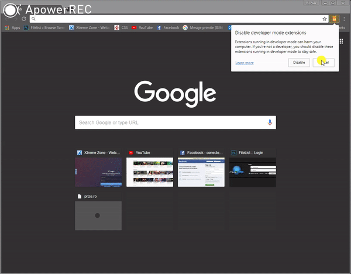

 

# chrome-extension

### This is a simple chrome extension.

### For tutorial about how you can contribute to the project please read the:
### [contributeTUTORIAL.md](contributeTUTORIAL.md)
[1]: https://github.com/WalkInProgress/ProteinTracker-ChromeExtension/blob/master/contributeTUTORIAL.md

We made this with Html, css, json, javascript and some adobe photoshop for icon
This will help the user to count daily protein that must be fullfiled.

In order to test this chrome extension follow the steps below:

## #1: activate developer mode in extension tab

 
 

## #2: add the project folder to extensions

 
 

## #3: an icon will appear with the extensions tab

 
 
 
 
 
 
### Enjoy!

## License

This project is licensed under the MIT License - see the [LICENSE.md](LICENSE) file for details
